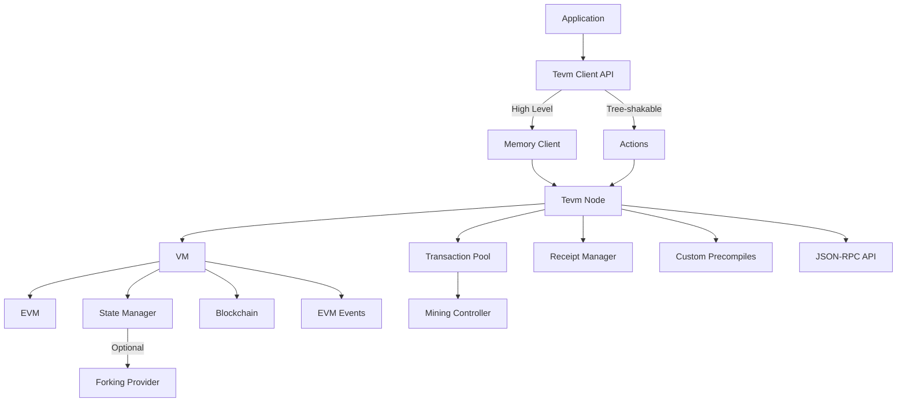

import { Callout, Steps, Button } from 'vocs/components'
import { TabGroup, FileTree, Card } from '../../../components'

# Tevm Architecture Overview

<Callout type="warning" title="Advanced Content">
This page covers the internal architecture of Tevm and is intended for advanced users, contributors, or those looking to understand how Tevm works under the hood. If you're just getting started, we recommend the [viem API guide](../getting-started/viem) instead.
</Callout>

Tevm's architecture is designed to be modular, extensible, and compatible with the broader JavaScript ecosystem. This guide explains the core components and how they work together to create a complete Ethereum execution environment.



## Design Philosophy: Objects and Actions

At its core, Tevm follows a clear separation between **Objects** (stateful components) and **Actions** (pure functions that operate on those objects). This pattern, inspired by [viem](https://viem.sh/), enables tree-shaking and a composable API.

<div className="grid grid-cols-1 lg:grid-cols-2 gap-6 my-6">
  <Card title="Objects">
    <p>Stateful components that encapsulate and maintain data.</p>
    <ul className="custom-list">
      <li><code>TevmNode</code> - The core Node interface</li>
      <li><code>Evm</code> - The Ethereum Virtual Machine</li>
      <li><code>StateManager</code> - Manages blockchain state</li>
      <li><code>Blockchain</code> - Handles blocks and chain state</li>
    </ul>
  </Card>
  
  <Card title="Actions">
    <p>Pure functions that take an object as their first parameter and perform operations.</p>
    <ul className="custom-list">
      <li>Tree-shakable for minimal bundle size</li>
      <li>Single-purpose with clear input/output</li>
      <li>Composable for complex operations</li>
      <li>Can be imported individually</li>
    </ul>
  </Card>
</div>

<style>
{`
  .custom-list {
    padding-left: 1.5rem;
import { Steps, Step } from "vocs/components";

  }
  .custom-list li {
    margin-bottom: 0.5rem;
  }
`}
</style>

### Example: Using an Action

Here's how to use a tree-shakable action with a Tevm Node:

```ts showLineNumbers {1-2,5,8,11} filename="action-example.ts"
import { createTevmNode } from 'tevm'
import { getAccountHandler } from 'tevm/actions' // [!code focus]

// 1. Create the node object
const node = createTevmNode() // [!code focus]

// 2. Create a handler function by passing the node to the action
const getAccount = getAccountHandler(node) // [!code focus]

// 3. Use the handler function with specific parameters
const account = await getAccount({ // [!code focus]
  address: '0x1234567890123456789012345678901234567890'
})

console.log(account.balance) // Access account properties
```

This pattern allows you to:
- Import only the actions you need
- Create specialized handler functions for specific objects
- Follow a consistent interface across the library

## Client Options: Convenience vs. Tree Shaking

Tevm offers two main approaches for using its functionality:

<TabGroup items={['MemoryClient: All-in-One', 'Tree-Shakable: Optimized']}>
  <div data-title="MemoryClient: All-in-One">
    ```ts showLineNumbers {1,4-8,11-13,16-19} filename="memory-client.ts"
    import { createMemoryClient, http } from 'tevm'
    
    // Create a client with all actions pre-attached
    const client = createMemoryClient({
      fork: {
        transport: http('https://eth-mainnet.g.alchemy.com/v2/YOUR_KEY')
      }
    })
    
    // Use standard viem actions
    const code = await client.getContractCode({ // [!code focus]
      address: '0x1234567890123456789012345678901234567890' // [!code focus]
    }) // [!code focus]
    
    // Use Tevm-specific actions (prefixed with 'tevm')
    const state = await client.tevmDumpState() // [!code focus]
    const balance = await client.getBalance({  // [!code focus]
      address: '0x1234567890123456789012345678901234567890'  // [!code focus]
    }) // [!code focus]
    ```
    <Callout type="info" title="Convenience Choice">
      The MemoryClient approach is great for quick prototyping and applications where bundle size isn't critical.
    </Callout>
  </div>
  
  <div data-title="Tree-Shakable: Optimized">
    ```ts showLineNumbers {1-4,7-12,15-16,19-22} filename="tree-shakable.ts"
    import { createClient, http } from 'viem'
    import { createTevmTransport } from 'tevm/transport'
    import { getBlock, getBlockNumber } from 'viem/actions' // [!code focus]
    import { tevmSetAccount, tevmMine } from 'tevm/actions' // [!code focus]
    
    // Create a client with just the transport
    const client = createClient({
      transport: createTevmTransport({
        fork: {
          transport: http('https://eth-mainnet.g.alchemy.com/v2/YOUR_KEY')
        }
      })
    })
    
    // Import and use only the specific actions you need
    const blockNumber = await getBlockNumber(client) // [!code focus]
    const block = await getBlock(client) // [!code focus]
    
    // Tevm-specific actions
    await tevmSetAccount(client, {  // [!code focus]
      address: '0x1234...',  // [!code focus]
      balance: 1000000000000000000n  // [!code focus]
    }) // [!code focus]
    await tevmMine(client, { blocks: 1 }) // [!code focus]
    ```
    <Callout type="tip" title="Production Optimization">
      This approach is ideal for production applications and browser environments where bundle size matters.
    </Callout>
  </div>
</TabGroup>

<div className="flex flex-wrap gap-4 my-6">
  <Card title="MemoryClient" className="flex-1 min-w-[250px]">
    <ul className="custom-list">
      <li>✅ Easy to get started</li>
      <li>✅ All methods available immediately</li>
      <li>✅ Less code to write</li>
      <li>❌ Larger bundle size</li>
    </ul>
  </Card>
  
  <Card title="Tree-Shakable Actions" className="flex-1 min-w-[250px]">
    <ul className="custom-list">
      <li>✅ Smallest possible bundle size</li>
      <li>✅ Only include what you use</li>
      <li>✅ Works with code-splitting</li>
      <li>❌ More verbose imports</li>
    </ul>
  </Card>
</div>

For more details on tree-shakable actions, see the [viem documentation on tree-shaking](https://wagmi.sh/react/guides/viem).

## Core Architecture Components

Tevm's modular architecture comprises several key components that work together to provide a complete Ethereum execution environment:

<Steps>
<Step title="Virtual Machine (EVM)">

The execution engine that runs EVM bytecode with full support for all opcodes and precompiles.

```ts
// Access via
const evm = (await node.getVm()).evm

// Features
evm.events.on('step', (data, next) => {
  // Monitor every EVM operation
  console.log(`Opcode: ${data.opcode.name}`)
  next()
})

// Control execution gas limits, precompiles, etc.
```

</Step>

<Step title="State Manager">

Maintains account balances, contract code, and storage state with forking capability from live networks.

```ts
// Access via
const stateManager = (await node.getVm()).stateManager

// Features
await stateManager.putAccount(address, account)
await stateManager.getAccount(address)
await stateManager.getContractStorage(address, key)
await stateManager.checkpoint() // Create state snapshot
await stateManager.revert(checkpointId) // Revert to snapshot
```

</Step>

<Step title="Blockchain">

Manages blocks, chain state, and handles block production with various mining strategies.

```ts
// Access via
const blockchain = (await node.getVm()).blockchain

// Features
await blockchain.getBlock(blockHash)
await blockchain.getBlockByNumber(blockNumber)
await blockchain.putBlock(block)
await blockchain.getLatestBlock()
```

</Step>

<Step title="Transaction Pool">

Manages pending transactions, orders them by gas price, and handles transaction validation.

```ts
// Access via
const txPool = await node.getTxPool()

// Features
await txPool.add(transaction)
await txPool.getTransactions()
const pendingTxs = txPool.getPendingTransactions()
const pendingNonces = txPool.getPendingNonce(address)
```
</Step>

</Steps>

## Use Cases & Capabilities

Tevm enables several powerful use cases that were previously difficult or impossible with traditional Ethereum clients:

```ts title="Advanced Debugging"
import { createTevmNode } from 'tevm'
import { runCall } from 'tevm/vm'

const node = createTevmNode()
const vm = await node.getVm()

// Add EVM execution hooks
vm.evm.events.on('step', (data, next) => {
  console.log(`Executing ${data.opcode.name} at PC=${data.pc}`)
  console.log(`Stack: ${data.stack.join(', ')}`)
  next?.()
})

// Execute contract call
await runCall(vm)({
  to: '0x1234567890123456789012345678901234567890',
  data: '0xabcdef12' // Call data
})
```

```ts title="Cross-Environment"
// Works in Node.js
const nodejsClient = createMemoryClient()

// Works in browsers
const browserClient = createMemoryClient()

// Works in serverless functions
export default async function handler(req, res) {
  const client = createMemoryClient()
  const balance = await client.getBalance({ 
    address: req.body.address 
  })
  return res.json({ balance })
}
```

```ts title="Custom Tools"
import { createMemoryClient } from 'tevm'

export async function simulateTransaction(tx) {
  const client = createMemoryClient()
  
  // Take snapshot of current state
  const snapshot = await client.tevmSnapshot()
  
  try {
    // Execute transaction
    const receipt = await client.sendTransaction(tx)
    await client.mine()
    
    // Check transaction results
    const logs = receipt.logs
    const gasUsed = receipt.gasUsed
    const events = parseEvents(logs)
    
    return { success: true, gasUsed, events }
  } finally {
    // Always revert to original state
    await client.tevmRevert(snapshot)
  }
}
```

### Custom Tool Opportunities

<div className="grid grid-cols-1 sm:grid-cols-2 lg:grid-cols-4 gap-4 my-6">
  <Card title="Transaction Simulators">
    <p>Preview transaction outcomes before sending to mainnet</p>
  </Card>
  
  <Card title="EVM Debuggers">
    <p>Step through transactions with full state visibility</p>
  </Card>
  
  <Card title="Local-first dApps">
    <p>Build apps that work offline with optimistic updates</p>
  </Card>
  
  <Card title="Educational Tools">
    <p>Create interactive EVM learning experiences</p>
  </Card>
  
  <Card title="CI/CD Integration">
    <p>Test smart contracts in continuous integration pipelines</p>
  </Card>
  
  <Card title="Gas Optimization">
    <p>Analyze contract gas usage patterns with precision</p>
  </Card>
  
  <Card title="Serverless Execution">
    <p>Run Ethereum nodes in serverless or edge computing environments</p>
  </Card>

  <Card title="State Snapshots">
    <p>Create, save, and restore blockchain state at precise points</p>
  </Card>
</div>

For detailed examples of these use cases, see the [examples section](../examples/viem.mdx).

## API Interfaces

<Callout type="tip" title="Choose Your API Level">
  Tevm provides multiple API layers to suit different needs and programming styles.
</Callout>

<div className="api-table">

| API Level | Description | Best For |
|-----------|-------------|----------|
| **Viem Client API** | Standard viem actions plus Tevm-specific actions | Most application development |
| **JSON-RPC API** | Standard Ethereum RPC methods plus Anvil and Tevm-specific methods | Direct RPC integration, tooling |
| **TevmNode API** | Direct access to the node and its components | Advanced use cases, custom extensions |
| **Low-Level Components** | Direct access to EVM, StateManager, Blockchain, etc. | Tool developers, deep customization |

</div>

<style>
{`
  .api-table table {
    display: table;
    width: 100%;
    margin: 1.5rem 0;
    border-collapse: collapse;
  }
  .api-table th {
    background-color: var(--vocs-color_background2);
    font-weight: var(--vocs-fontWeight_semibold);
    text-align: left;
    padding: 0.75rem 1rem;
  }
  .api-table td {
    padding: 0.75rem 1rem;
    border-top: 1px solid var(--vocs-color_border);
  }
  .api-table tr:nth-child(even) {
    background-color: var(--vocs-color_background1);
  }
`}
</style>

<FileTree>
  <FileTree.Folder name="API Layers" defaultOpen>
    <FileTree.Folder name="Viem Client API (high-level)" defaultOpen>
      <FileTree.File name="client.getBalance()" />
      <FileTree.File name="client.tevmMine()" />
      <FileTree.File name="client.sendTransaction()" />
    </FileTree.Folder>
    <FileTree.Folder name="JSON-RPC API">
      <FileTree.File name="eth_getBalance" />
      <FileTree.File name="anvil_mine" />
      <FileTree.File name="tevm_dumpState" />
    </FileTree.Folder>
    <FileTree.Folder name="TevmNode API">
      <FileTree.File name="node.getVm()" />
      <FileTree.File name="node.getTxPool()" />
      <FileTree.File name="node.extend()" />
    </FileTree.Folder>
    <FileTree.Folder name="Low-Level Components">
      <FileTree.File name="vm.evm.runCall()" />
      <FileTree.File name="stateManager.getAccount()" />
      <FileTree.File name="blockchain.putBlock()" />
    </FileTree.Folder>
  </FileTree.Folder>
</FileTree>

<TabGroup items={['Client API', 'JSON-RPC API', 'Low-Level API']}>
  <div data-title="Client API">
    ```ts showLineNumbers {1,3,6-7,10-13} filename="client-api.ts"
    import { createMemoryClient } from 'tevm'
    
    const client = createMemoryClient()
    
    // Standard viem actions
    const balance = await client.getBalance({ address: '0x123...' }) // [!code focus]
    const blockNumber = await client.getBlockNumber() // [!code focus]
    
    // Tevm-specific actions
    await client.tevmSetAccount({  // [!code focus]
      address: '0x123...',  // [!code focus]
      balance: 1000000000000000000n  // [!code focus]
    })  // [!code focus]
    await client.tevmMine()
    ```
    <Callout type="info">
      This is the most developer-friendly API, perfect for most application development.
    </Callout>
  </div>

  <div data-title="JSON-RPC API">
    ```ts showLineNumbers {1-2,4,7-10,13-16,19-22} filename="json-rpc-api.ts"
    import { createTevmNode } from 'tevm'
    import { requestEip1193 } from 'tevm/decorators'
    
    const node = createTevmNode().extend(requestEip1193())
    
    // Standard Ethereum JSON-RPC methods
    const balance = await node.request({ // [!code focus]
      method: 'eth_getBalance', // [!code focus]
      params: ['0x123...', 'latest'] // [!code focus]
    }) // [!code focus]
    
    // Anvil-compatible methods
    await node.request({ // [!code focus]
      method: 'anvil_setBalance', // [!code focus]
      params: ['0x123...', '0x10000000000000000'] // [!code focus]
    }) // [!code focus]
    
    // Tevm-specific methods
    const state = await node.request({ // [!code focus]
      method: 'tevm_dumpState', // [!code focus]
      params: [] // [!code focus]
    }) // [!code focus]
    ```
  </div>

  <div data-title="Low-Level API">
    ```ts showLineNumbers {1-2,4-5,8-12,15-22,25} filename="low-level-api.ts"
    import { createTevmNode } from 'tevm'
    import { createAddress } from 'tevm/address'
    
    const node = createTevmNode()
    const vm = await node.getVm()
    
    // Direct EVM access
    vm.evm.events.on('step', (data, next) => { // [!code focus]
      // Inspect execution at each EVM step // [!code focus]
      console.log(data.opcode.name, data.stack) // [!code focus]
      next?.() // [!code focus]
    }) // [!code focus]
    
    // Direct state management
    await vm.stateManager.putAccount( // [!code focus]
      createAddress('0x123...'), // [!code focus]
      { // [!code focus]
        nonce: 0n, // [!code focus]
        balance: 10000000000000000000n, // [!code focus]
        storageRoot: '0x...', // [!code focus]
        codeHash: '0x...' // [!code focus]
      } // [!code focus]
    ) // [!code focus]
    
    // Direct blockchain control
    const block = await vm.blockchain.getBlockByNumber(1n)
    ```
    <Callout type="warning">
      This API provides maximum control but requires deeper understanding of EVM internals.
    </Callout>
  </div>
</TabGroup>

For component API details, see:
- [State Manager](/reference/state)
- [Transaction Pool](/reference/txpool)
- [Blockchain](/reference/blockchain)
- [EVM](/reference/evm)
- [Receipt Manager](/reference/receipt-manager)

## Advanced Features

Tevm includes several powerful features that enable advanced use cases:

<Steps>
<Step title="Custom Precompiles">

Extend the EVM with JavaScript functions that can be called from smart contracts:

```ts
import { createTevmNode, definePrecompile } from 'tevm'
import { createContract } from 'tevm/contract'
import { parseAbi } from 'tevm'

// Define a precompile that provides an off-chain data oracle
const dataOraclePrecompile = definePrecompile({
  contract: createContract({
    abi: parseAbi(['function getCurrentPrice(string symbol) view returns (uint256)']),
    address: '0x0000000000000000000000000000000000000123'
  }),
  call: async ({ data }) => {
    // Parse input data and fetch external price data
    const symbol = parseInputData(data)
    const price = await fetchPriceData(symbol)
    
    return {
      returnValue: encodePrice(price),
      executionGasUsed: 3000n
    }
  }
})

// Create a node with the custom precompile
const node = createTevmNode({
  customPrecompiles: [dataOraclePrecompile.precompile()]
})
```

</Step>

<Step title="EVM Execution Hooks">

Instrument the EVM to observe and measure execution:

```ts
import { createTevmNode } from 'tevm'

const node = createTevmNode()
const vm = await node.getVm()

// Add detailed execution hooks
vm.evm.events.on('step', (step, next) => {
  console.log(`
    Operation: ${step.opcode.name}
    PC: ${step.pc}
    Gas Used: ${step.gasLeft}
    Stack: ${step.stack.join(', ')}
    Memory: ${step.memory.slice(0, 64)}...
  `)
  next?.() // Continue execution
})
```

</Step>

<Step title="Forking Capabilities">

Create local forks of any EVM chain with lazy-loading:

```ts
import { createTevmNode, http } from 'tevm'
import { mainnet } from 'tevm/common'

// Fork from Ethereum mainnet
const node = createTevmNode({
  fork: {
    transport: http('https://eth-mainnet.g.alchemy.com/v2/YOUR_KEY'),
    common: mainnet,
    blockTag: 18000000n // Optional: specific block number
  }
})

// State is loaded lazily - only accessed accounts are loaded
// This allows working with huge state trees efficiently
```

</Step>

<Step title="Contract Utilities">

Type-safe contract interactions with TypeScript support:

```ts
import { createContract } from 'tevm/contract'

// Define a contract interface
const erc20Contract = createContract({
  abi: [
    'function balanceOf(address owner) view returns (uint256)',
    'function transfer(address to, uint256 amount) returns (bool)',
    'event Transfer(address indexed from, address indexed to, uint256 value)'
  ],
  address: '0x123...' 
})

// Type-safe read and write operations
const balance = await erc20Contract.read.balanceOf('0x456...')
const txHash = await erc20Contract.write.transfer('0x789...', 1000n)
```
</Step>

</Steps>

For Tevm Bundler users, directly import Solidity with full type safety:

```ts
// Import Solidity directly (with tevm bundler plugins)
import { ERC20 } from './ERC20.sol'

// Contract with full TypeScript types
const token = ERC20.withAddress('0x123...')

// Safe contract interaction
const decimals = await token.read.decimals()
```

## Extensibility Model

<details>
  <summary>Node Extension API</summary>
  Tevm's plugin system allows adding new functionality to nodes:

```ts
import { createTevmNode } from 'tevm'

// Create a node with extensions
const node = createTevmNode().extend((baseNode) => {
  // Add custom methods
  return {
    async simulateBulkTransactions(txs) {
      const results = []
      for (const tx of txs) {
        const vm = await baseNode.getVm()
        results.push(await vm.runTx({ tx }))
      }
      return results
    },
    
    async resetToSnapshot(snapshot) {
      const vm = await baseNode.getVm()
      return vm.stateManager.revert(snapshot)
    }
  }
})

// Use the extended functionality
const snapshot = await node.getVm().stateManager.checkpoint()
const results = await node.simulateBulkTransactions([tx1, tx2, tx3])
await node.resetToSnapshot(snapshot)
```

This extension model allows for powerful customizations while maintaining the core API.

</details>

## Next Steps

<div className="grid grid-cols-1 sm:grid-cols-2 lg:grid-cols-3 gap-4 my-6">
  <Button href="../core/create-tevm-node" className="h-auto p-4 flex flex-col items-start">
    <div className="font-medium mb-2">Create a Tevm Node</div>
    <div className="text-sm text-left">Learn how to create and configure a Tevm Node for your project.</div>
  </Button>
  
  <Button href="../examples/viem" className="h-auto p-4 flex flex-col items-start">
    <div className="font-medium mb-2">Viem Integration</div>
    <div className="text-sm text-left">See how to use Tevm with viem for a complete Ethereum development experience.</div>
  </Button>
  
  <Button href="../examples/local-testing" variant="accent" className="h-auto p-4 flex flex-col items-start">
    <div className="font-medium mb-2">Practical Examples</div>
    <div className="text-sm text-left">Explore real-world examples and use cases for Tevm Node.</div>
  </Button>
</div>

## Further Resources

| Resource | Description |
|----------|-------------|
| [TevmNode Interface Reference](/reference/node) | Detailed API reference for the core node interface |
| [GitHub Repository](https://github.com/evmts/tevm-monorepo) | Source code and contributions |
| [Custom Precompiles Guide](../advanced/custom-precompiles) | Learn how to extend the EVM |
| [Performance Profiling](../advanced/performance-profiler) | Optimize your Ethereum applications |
