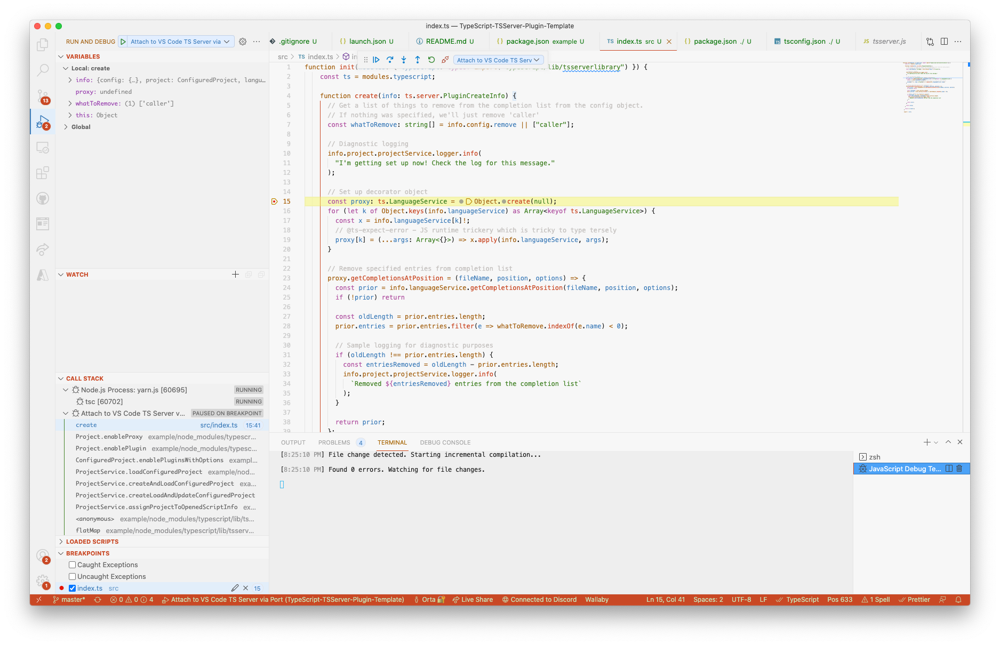

## A Template for a TypeScript Language Service Plugin



This repo has two projects:

- `/` is a TSServer Plugin 
- `/example` is a TypeScript project which uses the root TSServer Plugin

The source files for your project

#### Get Started

Get the plugin working and your TS to JS converted as you save:

```ts
git clone https://github.com/orta/TypeScript-TSServer-Plugin-Template
cd TypeScript-TSServer-Plugin-Template

# Install deps and run TypeScript
npm i
npx tsc --watch
```

Next, get the example project up and running, it will load your TSServer Plugin from the emitted JavaScript.

```
# Set up the host app to work in
cd example
npm i
cd ..

# Open one VS Code window to work on your plugin
code .

# Or to hook up a debugger, use this command
# to have the TSServer wait till you attach:
TSS_DEBUG_BRK=9559 code example

# or use this to hook in later:
TSS_DEBUG=9559 code example
```

You can then use the launch options in this root project to connect your debugger to the running TSServer in the other window. To see changes, run the command palette "TypeScript: Reload Project" to restart the TSServer for the project.

Make sure that the TypeScript version on that project runs from your `node_modules` and not the version which is embedded in vscode. You can see the logs via the vscode command 'TypeScript: Open TS Server Logs." ( search for 'Loading tsserver-plugin' to see whether it loaded correctly. )

### What Now?

This project has a `debugger` statement inside the completions which will trigger on completions, you can get that running and then you have proven the toolset works and get started building your plugin.

You can read up the docs on [Language Service Plugins in the TypeScript repo wiki](https://github.com/microsoft/TypeScript/wiki/Writing-a-Language-Service-Plugin#overview-writing-a-simple-plugin).
